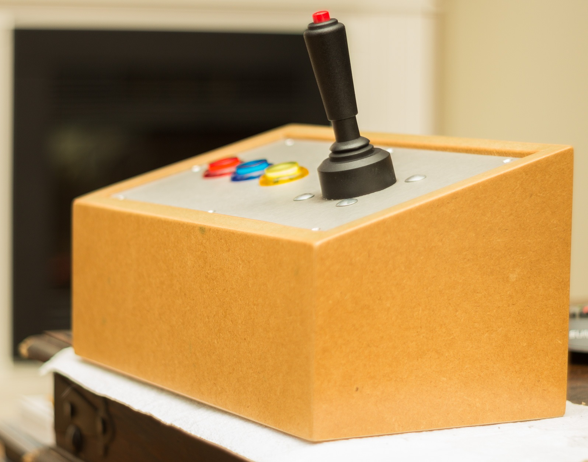

# Arduino Game Controller

After we built Red Blue Yellow, we had some time left...

We used that time to build an Arduino game controller. Here it is:

The joystick controls the mouse, the Red, Blue &amp; Yellow buttons act like keystrokes and presses '1', '2' &amp; '3'.

# To make this...

**1&emsp;Choose a compatible Arduino**

Use an Arduino (or a 3rd Party Arduino compatible board) with an ATmega 32u4 chip.

I used this one: https://www.aliexpress.com/item/CJMCU-BEETLE-Keyboard-BadUSB-ATMEGA32U4-DC-5V-16MHz-MINI-Development-Board-Module-For-Arduino-Leonardo-R3/32840551248.html

It's small, has the ATmega 32u4 chip which makes it able to act as mouse and keyboard and could be programmed via the Arduino IDE. Great!

**2&emsp;Make a prototype of the product &amp; code**

Wire it up, use a breadboard or solder it directly to some test buttons.

For the buttions, you could use the internal pull-up resistors of the Atmega 32U4 board instead of using your own, external pull-down resistors. This will save you some resistors.

**3&emsp;Get yourself actual arcade parts**

I bought parts from www.arcadewinkel.nl

**4&emsp;Make a nice box**

**5&emsp;Put the arcade parts in the box**

**6&emsp;Finish the box with a nice USB-jack**

I used this one and made it fit in my wooden box: http://goo.gl/uaqmPb

You could reverse the output.